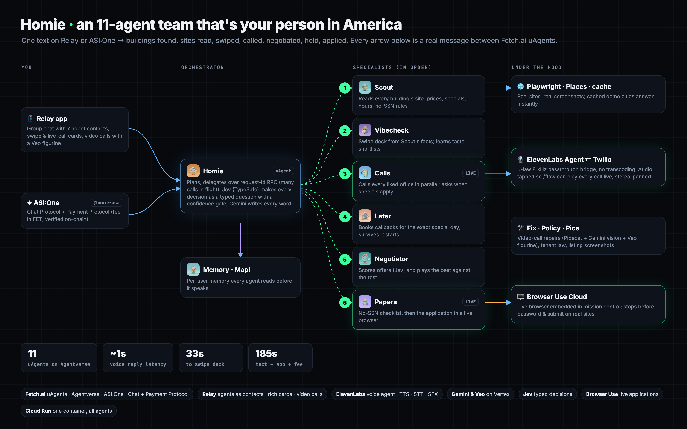

<p align="center">
  
</p>

<h1 align="center">Homie</h1>
<p align="center"><b>This isn't a chatbot. It's a team.</b><br/>
11 AI agents that find, call, negotiate and land your first US apartment, from one message, while you sleep.</p>

<p align="center">

     

</p>

<p align="center">
  <a href="https://youtu.be/zl_fpA4hX9Q"><b>▶ Watch the demo</b></a> ·
  <a href="https://homie-751583582765.us-central1.run.app">Mission control</a> ·
  <a href="https://homie-751583582765.us-central1.run.app/flow">Hear the calls live</a> ·
  <a href="https://asi1.ai">Chat with @homie-usa on ASI:One</a>
</p>

<p align="center">
  <a href="https://youtu.be/zl_fpA4hX9Q"></a>
</p>

---

## The problem

Renting in the US assumes you're already in the US:

- **Time zones:** leasing offices close before students abroad wake up.
- **Phones:** offices won't call international numbers back.
- **No SSN:** no credit check, so it's auto-reject or months of rent upfront.
- **Moving prices:** rents change daily, and specials last only days.
- **Locked information:** prices and rules hide in leasing portals with no API.
- **Payments:** deposits need US cashier's checks, and foreign wires don't count.

## What Homie does

Text it once, on **ASI:One** or **Relay**:

> *"Find me a 1 bedroom off campus near UC Berkeley under $3,500. I have no SSN."*

| Time | The team at work (from a live run on the deployed system) |
|---|---|
| **0s** | **Homie** reads the request (Jev decides route, bedrooms, no-SSN and urgency in one typed call) and recalls what **Memory** knows about you. |
| **33s** | **Scout** finds real buildings (Google Places) and reads every website for live prices, specials, hours and no-SSN rules. **Vibecheck** sends a numbered shortlist in chat, plus a swipe deck with photos. |
| **35s** | You reply *"1 3"* in ASI:One, or swipe. Vibecheck learns your taste. |
| **49s** | **Calls** dials every office you liked at once, with an ElevenLabs voice. You can listen to all of them live. It asks for the rent, *when the special applies*, and what they accept instead of an SSN. |
| **121s** | **Later** books a callback for the exact day each special kicks in. |
| **153s** | **Negotiator** plays the offers against each other. |
| **156s** | **Homie** holds the best deal. |
| **160–185s** | **Papers** opens the building's portal in a live browser: ✅ account → ✅ application → ✅ $50 fee *(sandbox portal in demo mode)*. |

**After you move in:** say *"my ice maker is broken"* and **video-call Fix on Relay**. A Pixar-style figurine looks through your camera, sees the problem, files the ticket with a photo, and chases the office until it's booked.

<p align="center"></p>

---

## 🤖 The team: 11 uAgents on Agentverse

| | Agent | Job | Address |
|---|---|---|---|
|  | **Homie** `@homie-usa` | Orchestrator. Chat Protocol + Payment Protocol | `agent1qwcg6lkqt9pmll49h0qe3zy3ajlqy08qemrqe48k5nwknt7h6kyhyvs9rps` |
|  | **Scout** | Reads every building's site into structured facts | `agent1q0hk8gqpa5wvd8mcafyvdhppr9r8ae9jw3dss5swmd3afpspgse9utwv3sa` |
|  | **Vibecheck** | Shortlist and swipe deck; learns your taste | `agent1qw997gd5awven0egprca6r62g04shle0vugpd467358jstvan6mfze37sha` |
|  | **Calls** | Parallel calls with a real-time ElevenLabs voice | `agent1qfmq6lcrjag58fxxqq8gpmjkkl948p8998m8lr08sgmtepc6k5k4utdcztj` |
|  | **Later** | Waits, then runs future tasks on time | `agent1qdj7s537sarkkw0lcqpat5n6st5hmwyr4zqq0wqa6ac4drwsh2wyq3wlzvs` |
|  | **Negotiator** | Scores offers, uses the best as leverage | `agent1qvyy8jffzqwz5mrldg5gmfk9xqr4qamny6hpmdnkqjjefzmwx3xkwhy6klg` |
|  | **Papers** | No-SSN checklist; the application in a live browser | `agent1qw3ft6ycanku4spz9ng8jj56upzmmqhzlspdrd5wnemnz35phsm7zqsl9m9` |
|  | **Policy** | Leases, deposits, tenant law | `agent1qfr7q89z8hrkf8yh046ghxu0uk4m3pkmqaz3ngaznsqtt2qdyxr7ywygrv4` |
|  | **Pics** | Screenshots listings, reads live prices | `agent1q077xn0rftvwdpx54qzqfce8v3u2e60ldl2wtfvfsckg6tyzt9hy240l06s` |
|  | **Memory** | Per-user memory every agent reads (Mapi) | `agent1qff0lvefgk3etwvjp7h4a08725cc3yz0ftd0lrdf7p9kxw9zpa7v5nfsq80` |
|  | **Fix** | Repairs via video call with camera vision | `agent1qwa6jlt60t3rqz2lr8rv2cj5e09u9lwtxp0zntc835g8hj3mfugl2zk7sz8` |

Agentverse profiles live at `https://agentverse.ai/agents/details/<address>/profile`.

---

## 🧠 How it works

### Fetch.ai
- **Every agent is a uAgent with its own address,** registered as a mailbox agent on **Agentverse** (`scripts/agentverse_publish.py`).
- **Homie speaks the Agent Chat Protocol,** so the whole flow runs inside one **ASI:One** conversation.
- **Payment Protocol:** Homie is a seller. When you get your keys, it sends `RequestPayment` for its fee in FET and verifies the transaction on-chain before sending `CompletePayment`.
- **Request-id RPC** (`homie/rpc.py`) replaces `send_and_receive`, so dozens of agent-to-agent requests can be in flight at once without session collisions.
- **Later is a long-running agent.** Its tasks live in agent storage, survive restarts, and fire on time.

### Relay
- **Seven agents are real Relay contacts,** plus a **Homie Team** group chat where they talk to you and to each other (`relay_app/runtime.py`).
- **Rich cards** for the swipe deck, Approve, the live application and live calls.
- **📹 Video calls:**
  - A Veo-animated figurine answers with ElevenLabs speech-to-text, Gemini Flash-Lite with tools, and ElevenLabs voice, streamed through Pipecat (`homie/avatar_call.py`).
  - It reads your camera with Gemini vision and files the maintenance ticket itself.
  - Browser version: `/live`.

### Live calls you can hear
- **Each call runs on an ElevenLabs Agent,** bridged from Twilio media streams in **μ-law 8 kHz with zero transcoding** (`homie/phone.py`). Replies come back in about 1 second.
- **The bridge taps both sides of the call.** `/flow` plays any call live, or **all of them at once, panned in stereo**.
- **The agent always says it's an AI assistant calling for a student.**

### Decisions with Jev, words with Gemini
- **Every decision is a typed Jev question** (`Choice`, `Noul`, `Score`), fanned out in one call and acted on only above a confidence gate (`homie/jev.py`).
- **Gemini 2.5 on Vertex writes every message.**

### Live applications with Browser Use
- **Papers drives a Browser Use Cloud browser,** embedded live in mission control (`homie/apply.py`).
- **On real portals,** it fills your details and stops before the password and submit.
- **In demo mode,** it runs account → application → fee on the built-in sandbox portal (`/portal`).

---

## 🚀 Run it

**Requirements:**
- Python 3.13 and a Google Cloud project with Vertex AI and the Places API (New) enabled.
- An Agentverse API key, and Relay agent tokens.
- Optional: Twilio, ElevenLabs, Browser Use, Jev (TypeSafe) and Mapi keys. Every one has a fallback.

```bash
git clone https://github.com/kbhatnagar1506/homie && cd homie
python3 -m venv .venv && .venv/bin/pip install -r requirements.txt
.venv/bin/playwright install chromium
cp .env.example .env                      # fill in seeds and keys; every variable is documented there
```

Run the hub, then all 11 agents plus the Relay team:

```bash
.venv/bin/uvicorn hub.server:app --port 8080
.venv/bin/python -m agents.run
```

Open http://localhost:8080 (mission control) and http://localhost:8080/flow (live wireframe and calls).

### Test it without ASI:One or Relay

```bash
# the full flow, end to end, with demo calls and cached cities (Berkeley, SF, Stanford, Atlanta, Georgia Tech, UMich)
DEMO_MODE=1 MOCK_CALLS=1 AUTO_APPROVE=1 .venv/bin/python -m scripts.simulate "find me a 1 bedroom near UC Berkeley under 3500, no SSN"

# pick buildings by chat reply instead of swiping
SIM_CHAT_PICKS="1 3" DEMO_MODE=1 MOCK_CALLS=1 .venv/bin/python -m scripts.simulate "find me a studio in San Francisco under 4000"

.venv/bin/python -m scripts.selftest      # Places, Gemini, Mapi, website reading
.venv/bin/python -m scripts.e2e           # every scenario + the phone stream + Relay voice
.venv/bin/python -m scripts.prewarm       # refresh the demo cache
```

### Publish and deploy

```bash
.venv/bin/python -m scripts.agentverse_publish     # register all 11 agents on Agentverse
gcloud run deploy homie --source . --region us-central1 --cpu 4 --memory 4Gi --concurrency 1000
```

One Cloud Run container runs the hub and every agent. Use one instance, with CPU always on, because the agents hold websockets and timers.

---

## 🧰 Built with

Fetch.ai uAgents · Agentverse · ASI:One · Chat Protocol · Payment Protocol · Relay · ElevenLabs (Agents, TTS, STT, SFX) · Twilio · Gemini 2.5 & Veo 3 on Vertex AI · Jev (TypeSafe) · Browser Use Cloud · Pipecat · Playwright · Google Places · Mapi · FastAPI · Cloud Run · Notability

## 📁 Repo map

| Path | What's there |
|---|---|
| `agents/` | Homie (`homie_agent.py`) and the 10 specialists (`specialists.py`) |
| `homie/` | RPC, calls and the phone bridge, Scout crawler, Jev decisions, Browser Use apply, cache, memory |
| `relay_app/` | Relay team runtime, personas and avatars |
| `hub/` | FastAPI hub: mission control, `/flow`, `/vibe`, `/portal`, `/live`, Twilio streams |
| `scripts/` | simulate, e2e, selftest, prewarm, publish, record and edit demo videos |
| `docs/` | Agent readmes for Agentverse, the architecture graphic, the Devpost write-up |

<p align="center"><br/><b>Built at MHacks 2026.</b> One text. Eleven agents. You wake up with an apartment. 🏠</p>
